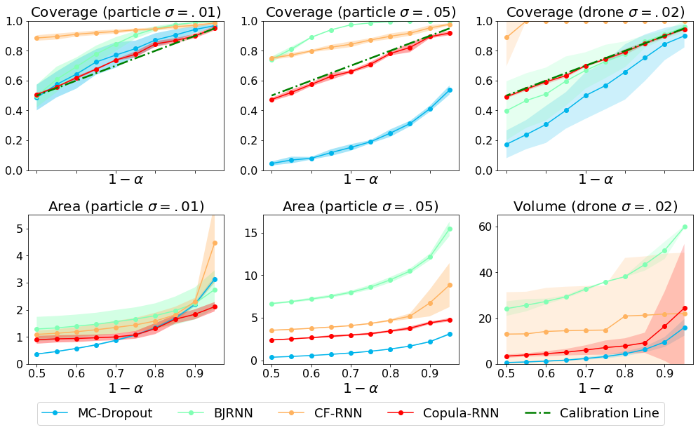

# Copula Conformal Prediction for Multi-step Time Series Forecasting [[Paper](https://arxiv.org/abs/2212.03281)]


## | Introduction

**Copula**  **C**onformal **P**rediction algorithm for multivariate, multi-step **T**ime **S**eries (CopulaCPTS) is a conformal prediction algorithm with full-horizon validity guarantee. 

## | Citation

[[2212.03281] Copula Conformal Prediction for Multi-step Time Series Forecasting](https://arxiv.org/abs/2212.03281)

```
@inproceedings{sun2023copula,
  title={Copula Conformal prediction for multi-step time series prediction},
  author={Sun, Sophia Huiwen and Yu, Rose},
  booktitle={The Twelfth International Conference on Learning Representations},
  year={2023}
}
```

## | Installation


```bash
pip install -r requirements.txt
```

## | Datasets

Please see below for links and refer to Section 5.1 and Appendix C.1 in the paper for processing details. 

[Particles](https://github.com/mitmul/chainer-nri) | [Drone](https://github.com/AtsushiSakai/PythonRobotics)| [Epidemiology](https://coronavirus.data.gov.uk/details/download) | [Argoverse 1](https://www.argoverse.org/av1.html)

The processed files for Particles, Drone, and Epidemiology datasets are located in the `./data` directory. If you want to reporduce the visualizations, you might need to refer to the original sources for metadata.


## | Training and Testing

To illustrate the usage of our code, we have included pre-generated NRI Particles data in this repository. To replicate the experiment, simply run:

```bash
./run_experiment.sh
```

## | Recreate plots in the paper

Please see ```Visualization.ipynb``` for example code for creating Figure 3 in the paper.

